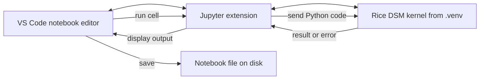
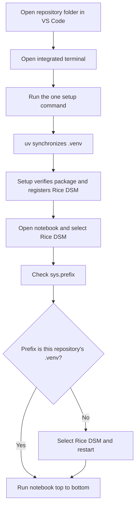

# How the course Python project works

This document explains the complete path from downloading the repository to
running Python in a notebook. It assumes no prior familiarity with Python
environments, packages, terminals, or Jupyter.

Lectures 1 and 2 use the setup recipe without requiring every implementation
detail. Read this document with Lecture 3, when the course studies packaging,
dependencies, versioning, imports, and reproducibility directly.

The most important idea is that several separate tools cooperate. A notebook
may look like one application, but editing a file, running Python, installing a
package, and displaying output are different jobs performed by different
programs.

## The short version

From the repository root, run:

```text
uv run python scripts/setup_course.py
```

`uv run` synchronizes the course environment before executing the setup script.
The script verifies the package and gives the environment a clear **Rice DSM**
kernel name. It then exits; students edit, navigate, and run notebooks in VS
Code. Everything else in this document explains why that command works and how
to diagnose it when it does not.

## The pieces and their responsibilities

| Piece | What it is | What it does in this course |
| --- | --- | --- |
| Repository | A version-controlled folder | Stores notebooks, source code, tests, configuration, and documentation |
| Terminal | A text interface to the computer | Provides a place to enter commands |
| Shell | The program interpreting terminal commands | Finds programs, passes arguments, and tracks the current directory |
| Python interpreter | A program that executes Python code | Runs scripts, tests, and notebook code |
| `uv` | A Python project and environment manager | Selects Python, creates `.venv`, locks dependencies, installs packages, and runs commands |
| Virtual environment | An isolated Python installation directory | Keeps this course's interpreter and installed packages separate from other projects |
| Python package | Reusable importable code | Provides the evolving `rice_dsm` library |
| VS Code | The course editor and workspace | Navigates files and displays notebook documents |
| Jupyter extension | A VS Code extension | Connects notebook cells to the selected kernel |
| Kernel | A long-running language process | Executes notebook cells and remembers variables between cells |
| Notebook | A JSON document ending in `.ipynb` | Stores Markdown cells, code cells, metadata, and optionally outputs |

## 1. The repository is the project boundary

The repository root is the top-level course directory. Important entries are:

```text
Data-Science-Machine-Learning-Fall-2026/
├── pyproject.toml
├── uv.lock
├── .python-version
├── .venv/                     # generated locally; not committed
├── notebooks/
├── src/
│   └── rice_dsm/
└── tests/
```

The current working directory tells tools where to begin looking for project
configuration. Running a command from the repository root is reliable because
`pyproject.toml` and `uv.lock` are immediately visible there.

Use these commands to check location:

```text
pwd
ls
```

In PowerShell, `pwd` and `ls` are aliases for `Get-Location` and
`Get-ChildItem`. At the root, the listing should include `pyproject.toml`.

## 2. `pyproject.toml` states the project's intent

`pyproject.toml` is a human-authored configuration file. It records information
such as:

- the distribution name, `rice-dsm`;
- the required Python version;
- direct runtime and development dependencies;
- the build backend used to package the source;
- pytest and Ruff configuration.

The declared dependency list expresses acceptable requirements, such as
`pytest>=8.3`. It does not necessarily specify one exact version for every
transitive dependency.

The build-system section matters because `src/rice_dsm/` is source code, not
automatically an installed package. The `uv_build` backend describes how that
source becomes an installable Python distribution.

## 3. `uv.lock` records a reproducible solution

Many packages depend on other packages. Resolving all compatible versions is a
dependency-solving problem. `uv.lock` records the exact solution selected for
the supported platforms.

The distinction is:

- `pyproject.toml`: what the project permits and directly requires;
- `uv.lock`: the complete resolved versions used to reproduce the environment.

The lockfile is committed to Git. Students should not edit it manually. `uv`
updates it when project dependencies change.

## 4. `uv sync` makes the computer match the project

When run from the repository root, `uv sync`:

1. reads `.python-version` and the Python requirement in `pyproject.toml`;
2. obtains or selects a compatible Python interpreter;
3. checks that `uv.lock` agrees with `pyproject.toml`;
4. creates `.venv` if it does not exist;
5. installs the locked dependencies into `.venv`; and
6. installs the local `rice-dsm` project in editable mode.

The operation is called **syncing** because the environment is made consistent
with the project definition. It is not merely “install whatever is missing.” An
exact sync can also remove packages that do not belong to the declared project.

This repository sets `link-mode = "copy"` under `[tool.uv]`. `uv` can reuse its
download cache through several link strategies; copy mode materializes ordinary
files in `.venv` and gives consistent filesystem behavior across the supported
course platforms. This is an implementation setting, not a command students
need to memorize.

## 5. `.venv` isolates this course from other projects

Your computer may contain several Python interpreters:

```text
system Python
another course's .venv Python
this repository's .venv Python
```

Each interpreter has its own locations for installed third-party packages. A
package installed for one interpreter is not automatically visible to another.
That isolation prevents one project from breaking another through incompatible
upgrades.

In this repository, the relevant interpreter path resembles:

```text
.venv/bin/python                 # macOS and Linux
.venv\Scripts\python.exe         # Windows
```

The `.venv` folder is generated, machine-specific, and potentially large, so it
is excluded from Git. Another student recreates it using the committed project
files rather than receiving your copy.

## 6. `uv run` chooses the environment without activation

If you type `python` by itself, the shell searches its `PATH` and may find a
global interpreter. If you type:

```text
uv run python
```

`uv` first checks the project environment and then runs the environment's
Python. The same applies to other programs:

```text
uv run pytest
uv run ruff check src tests
uv run python scripts/setup_course.py
```

This course uses `uv run` so students do not need to learn platform-specific
virtual-environment activation before they can work reliably.

## 7. Distribution names and import names can differ

The project has two related names:

```text
rice-dsm       # distribution/project name used by packaging tools
rice_dsm       # Python import package name
```

Python identifiers cannot contain hyphens, so an underscore is used in import
statements:

```python
import rice_dsm
```

The source package is the directory `src/rice_dsm/`. Its `__init__.py` defines
the public interface available directly from `rice_dsm`.

## 8. Editable installation connects `.venv` to `src/`

A normal package installation copies built package files into the environment.
During development, those copies would become stale whenever the course source
changes.

An editable installation instead places a small link in the environment's
`site-packages` directory. For this project, `uv_build` creates a file named
`rice_dsm.pth` that points Python toward the repository's `src/` directory.

Conceptually:

```text
.venv/.../site-packages/rice_dsm.pth
                    │
                    └── points to repository/src/
                                      │
                                      └── rice_dsm/
```

This is why editing `src/rice_dsm/records.py` changes the installed development
package without rebuilding after every edit. A running Python process may still
cache a previously imported module, so restart the notebook kernel after source
changes when in doubt.

There is one platform edge case. Some macOS filesystem/cache combinations can
give the editable `.pth` file a hidden flag, and Python then skips it during
startup. The course setup script also writes a small, generated
`sitecustomize.py` file inside `.venv`. Python loads that file directly, and it
adds the same `src/` directory to the startup search path. This is a compatibility
layer, not a second package copy. Automated tests deliberately start a fresh
Python process outside the repository to ensure this connection still works.

## 9. How Python resolves `import rice_dsm`

When a Python process encounters an import, it checks whether the module is
already loaded and then searches locations listed in `sys.path`.

The virtual environment's `site-packages` directory is one of those locations.
The editable-install `.pth` file adds the repository's `src/` directory. Python
then finds:

```text
src/rice_dsm/__init__.py
```

You can inspect this process:

```python
import rice_dsm
import sys

print(sys.executable)
print(sys.prefix)
print(rice_dsm.__file__)
print(sys.path)
```

`sys.prefix` identifies the environment providing installed packages. With a
uv-managed Python, `sys.executable` may resolve to uv's underlying interpreter
outside `.venv` even while `sys.prefix` correctly identifies `.venv`. Installing
a package into some other Python will not fix the current process.

## 10. VS Code is not the Python kernel

Before launching Jupyter, the setup command

```text
uv run python scripts/setup_course.py
```

prepares the editable-install startup connection and verifies that a fresh
Python process can import `rice_dsm`. On macOS, it clears a hidden filesystem
flag if that flag would cause Python to skip a `.pth` startup file. It then
writes a kernelspec inside `.venv`. A kernelspec is a small configuration that
tells Jupyter how to start a particular kernel. This one uses the environment's
Python and displays the name **Rice DSM**. A descriptive kernel name is safer
than choosing among several entries all labeled “Python 3.” After the command
finishes, opening a notebook in VS Code connects several cooperating pieces:



- VS Code provides the visible editor, file explorer, and terminal.
- The Jupyter extension coordinates notebook cell execution.
- The kernel executes code.
- The `.ipynb` file stores the notebook document.

## 11. A kernel remembers state

The Python kernel is a long-running process. If one cell creates `scores`, a
later cell can use `scores` because the object remains in the kernel's memory.

That convenience creates an important risk: a notebook may work after cells are
run out of order but fail for someone opening it fresh. Before sharing work:

1. restart the kernel;
2. run all cells from top to bottom; and
3. confirm that the notebook finishes without hidden state.

Saving a notebook can save displayed output, but it does not save the live
Python objects in kernel memory. After restarting, variables must be recreated
by running their cells.

### A notebook is a laboratory, not the whole system

Use a notebook to ask a question, try an idea, inspect data, draw a figure, and
explain what the result means. Do not make it the only place that trusted or
repeatable work exists. When code becomes reusable, move it into the package
and test it. When an operation must run without a person clicking cells, move
it into a script or workflow. Shared data belongs in durable storage, and a
tool used by other people belongs behind an explicit interface such as an API.

The notebook can still import, run, and explain all of those pieces. Its job is
to make the experiment understandable, not to keep a production service alive.
For a research project, it may narrate the analysis, but another researcher
must be able to reconstruct the data, configuration, computation, and outputs
without guessing the kernel's history.

## 12. What the kernel picker selects

Jupyter and VS Code may discover several Python environments. The kernel picker
determines which interpreter executes the notebook cells.

For this course, inspect:

```python
import sys

print(sys.executable)
print(sys.prefix)
```

The `sys.prefix` value should identify this repository's `.venv`. The executable
may display uv's underlying managed Python because the environment's executable
is a symbolic link; that alone does not indicate a problem. If `sys.prefix`
shows a system Python, Anaconda environment, or another project, select the
**Rice DSM** kernel and restart it.

## 13. The reliable startup sequence



## 14. Troubleshooting by layer

### `uv` is not recognized

The shell cannot locate the `uv` program. Install it using the official guide,
then close and reopen the terminal so its `PATH` is refreshed.

### No `pyproject.toml` is found

The shell is probably outside the repository. Run `pwd` and `ls`, then navigate
to the repository root.

### `ModuleNotFoundError: No module named 'rice_dsm'`

First run this in the terminal:

```text
uv run python scripts/setup_course.py
uv run python -c "import rice_dsm; print(rice_dsm.__file__)"
```

If that succeeds but the notebook import fails, the notebook is using a
different kernel. Inspect `sys.prefix`, select **Rice DSM**, restart, and
rerun.

### Changes in `src/rice_dsm/` do not appear

The current kernel probably imported the older version already. Restart the
kernel and run the notebook again from the beginning.

### A later cell says a variable is undefined

Run the notebook from the first cell downward. The cell that creates the
variable has not run in the current kernel.

### The notebook works only when cells run in a strange order

The notebook contains hidden state. Restart and run all. Reorder or rewrite
cells so each dependency is created before it is used.

## 15. A compact diagnostic report

When asking for help, include the output of these terminal commands:

```text
pwd
uv --version
uv run python --version
uv run python -c "import sys, rice_dsm; print(sys.executable); print(sys.prefix); print(rice_dsm.__file__)"
```

Also include the notebook output from:

```python
import sys

print(sys.executable)
print(sys.prefix)
```

This evidence usually separates a location problem, environment problem,
installation problem, and notebook-kernel problem quickly.

## Vocabulary recap

- **Dependency:** a package required by this project.
- **Distribution:** an installable project identified by packaging metadata.
- **Editable install:** an installation that links to working source code.
- **Interpreter:** the executable program that runs Python code.
- **Kernel:** a long-running process that executes notebook cells.
- **Lockfile:** the resolved dependency versions used for reproducibility.
- **Module:** one importable Python file.
- **Package:** an importable namespace containing modules or subpackages.
- **Repository:** the version-controlled project directory.
- **Shell:** the command interpreter running inside a terminal.
- **Virtual environment:** an isolated Python installation and package location.

## Further reading

- [`uv` project structure and files](https://docs.astral.sh/uv/concepts/projects/layout/)
- [`uv` locking and syncing](https://docs.astral.sh/uv/concepts/projects/sync/)
- [`uv` running commands](https://docs.astral.sh/uv/concepts/projects/run/)
- [Python virtual environments](https://docs.python.org/3/tutorial/venv.html)
- [What is Jupyter?](https://docs.jupyter.org/en/latest/what_is_jupyter.html)
- [Jupyter architecture](https://docs.jupyter.org/en/stable/projects/architecture/content-architecture.html)
