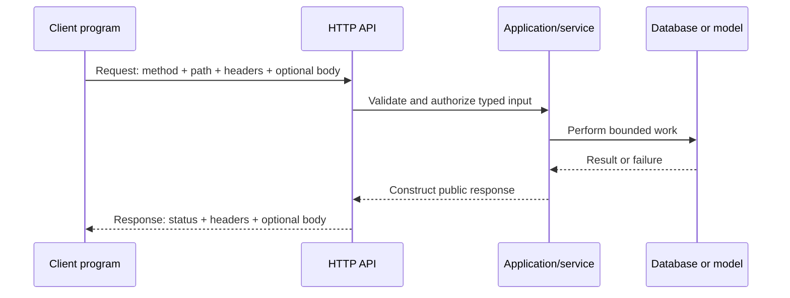
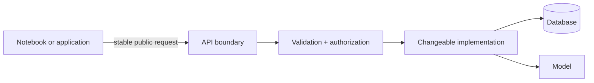
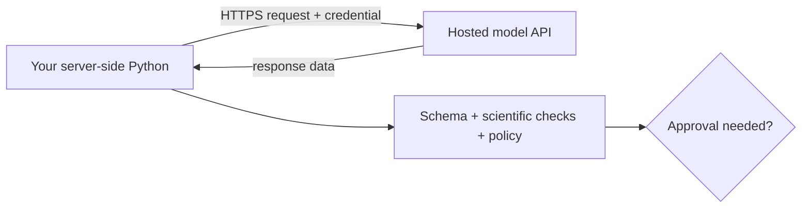

# What is an API?

API stands for **application programming interface**. An API is a documented
way for one piece of software to ask another piece of software to do something
or provide information.

The important word is **interface**: an agreed boundary between a caller and an
implementation. The caller needs to know the agreement, not every internal
detail. This lets teams reuse software, automate work, test boundaries, and
improve an implementation without forcing every caller to change.

An API is not necessarily a website, an internet service, or artificial
intelligence. Python functions have APIs. Packages have APIs. Databases expose
APIs. A program running on your own laptop can expose a web API to another local
program.

## A familiar Python API

Consider this function:

```python
def mean(values: list[float]) -> float:
    """Return the arithmetic mean of a nonempty sequence."""
```

Its public interface includes more than its name:

- how to import and call it;
- the accepted argument and its meaning;
- the returned value and units;
- what happens for an empty list or invalid value;
- documented side effects, if any; and
- which behavior future versions promise to preserve.

The loop used to compute the mean is an implementation detail. A maintainer may
replace that loop without changing the API. Renaming `values`, changing the
return type, or changing the empty-input behavior may break callers because
those decisions can be part of the contract.

A **package API** is the collection of names and behaviors a package intends
other code to use. Names beginning with `_` are conventionally private details.
An import may still be technically possible without being a compatibility
promise.

## A web API

A web API carries the same caller–implementation idea across a process or
network boundary. The caller is called a **client**; the program receiving the
request is usually called a **server** or **service**.



For example:

```text
GET /api/v1/measurements/latest?limit=20
```

- `GET` is the HTTP **method**: the kind of operation requested.
- `/api/v1/measurements/latest` is the **path**.
- `limit=20` is a **query parameter**.
- The method and path together identify an **endpoint**: one operation offered
  by the service.
- Request **headers** carry metadata such as accepted format, authentication,
  tracing, or an idempotency key.
- A request **body**, often JSON, can carry structured input.
- The response **status code** summarizes the outcome, such as success, invalid
  input, missing data, or server failure.
- The response body carries public result or error data.

JSON is a data representation, not an API by itself. HTTP is a communication
protocol. The API is the complete agreement about operations, data, errors,
authorization, limits, compatibility, and meaning.

## Why not read the other program's database directly?

An API can enforce validation, authorization, units, invariants, logging, query
bounds, and stable response shapes. Direct database access would expose storage
details and often grant more authority than a caller needs. The service remains
free to change tables or model implementations while preserving its public
contract.



APIs do not automatically make systems secure or correct. Poorly designed APIs
can expose sensitive data, accept ambiguous input, hide failures, or allow too
much authority. The boundary must be designed and tested.

## APIs for hosted language models

When Python calls a hosted language-model API, the usual sequence is:

1. your code constructs a request containing the selected model, instructions,
   input, and perhaps schemas or tool definitions;
2. a client library turns those Python objects into an authenticated HTTPS
   request;
3. the provider validates the credential and request;
4. provider-operated computers run inference;
5. the provider returns structured response data; and
6. your code checks and decides how to use that untrusted output.

An **API key** is a secret credential used to identify or authorize the caller.
It can permit spending money or accessing data. It is not part of the scientific
prompt and must not appear in source code, notebooks, screenshots, browser code,
logs, or Git history.



A provider's Python **SDK** (software development kit) is a library that makes
the API easier to call. The SDK is not the hosted model and does not make
inference happen on your laptop. It constructs requests, handles transport, and
turns responses into convenient Python objects.

A local inference server may deliberately offer a similar API. In that case the
request may stay on your machine or controlled network, but the API boundary,
validation, access control, and error handling still matter.

## Other interfaces: GUI, CLI, library, and API

The same capability may expose several interfaces:

| Interface | Typical caller | Example interaction |
| --- | --- | --- |
| graphical user interface (GUI) | person | click a button in an application |
| command-line interface (CLI) | person or script | run `rice-dsm describe` |
| Python library API | Python code in the same process | call `describe(data)` |
| HTTP web API | another process, device, or service | send `GET /description` |

These layers can share application logic, but their contracts differ. A CLI
prints human-readable text and exit codes. A Python API returns objects or raises
exceptions. A web API returns protocol status, headers, and serialized data.

## Reading API documentation

Before calling an API, find:

- its purpose and non-goals;
- stable operation or function names;
- required and optional input, types, units, and size limits;
- returned data and ordering;
- errors and whether retrying is safe;
- authentication versus authorization requirements;
- rate limits, quotas, latency, and cost;
- privacy, retention, and logging behavior;
- version and deprecation policy; and
- a minimal example plus a way to test without production side effects.

Do not copy an example until you can point to the client, operation, inputs,
credential boundary, response, and possible failures.

## Common misconceptions

| Misconception | Correction |
| --- | --- |
| “API means internet.” | In-process Python functions and local services also have APIs. |
| “The API is the database.” | An API may mediate access to a database without exposing its schema. |
| “JSON is an API.” | JSON is one possible representation carried by an API. |
| “Installing an SDK installs the service.” | An SDK is client-side helper code; a hosted service runs elsewhere. |
| “A successful status means the result is scientifically true.” | Transport success and scientific validity are different checks. |
| “An API key belongs in the request example.” | Examples use variable names; real credentials remain outside code. |
| “Private means nobody can call it.” | Private often means unsupported, not technically unreachable. |

## Exercises

1. For `sorted(values, reverse=True)`, identify the caller, operation, inputs,
   output, error behavior, and one implementation detail that is not part of the
   public contract.
2. For `GET /api/v1/measurements/latest?limit=20`, label the method, path, query
   parameter, endpoint, client, and likely response.
3. Explain why a `200` response from a model API does not prove that a generated
   scientific statement is correct.
4. Compare a CLI, Python API, and HTTP API for starting the same training run.
   What should each return when validation fails?
5. Draw the boundary around an application you use. Which details must callers
   know, and which implementation details should be hidden?

## Checkpoint

In your own words, complete this sentence:

> An API is ________. It is useful because ________. A web API differs from a
> Python function API because ________.
