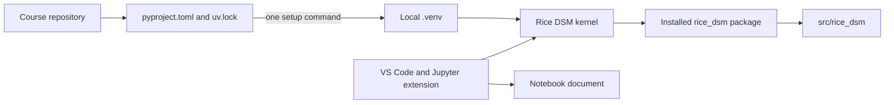
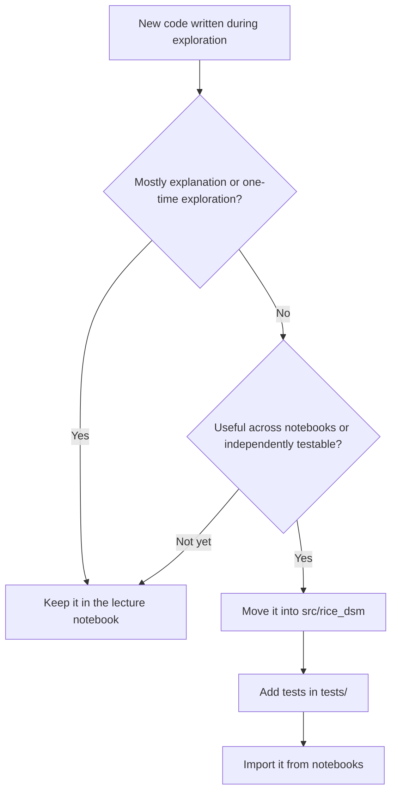
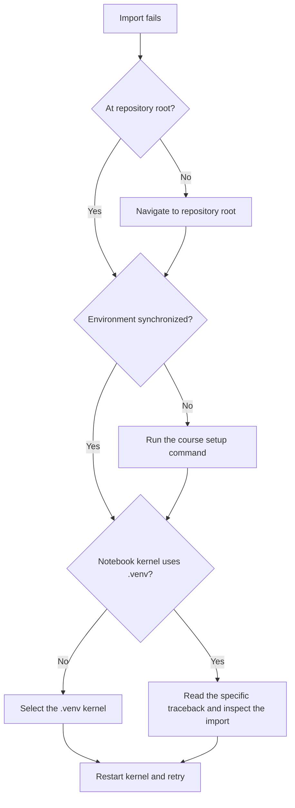
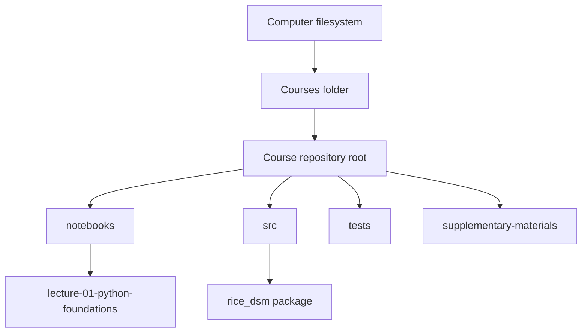
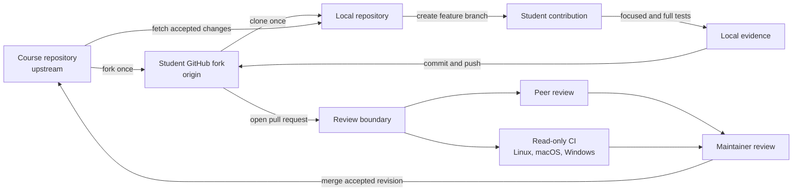
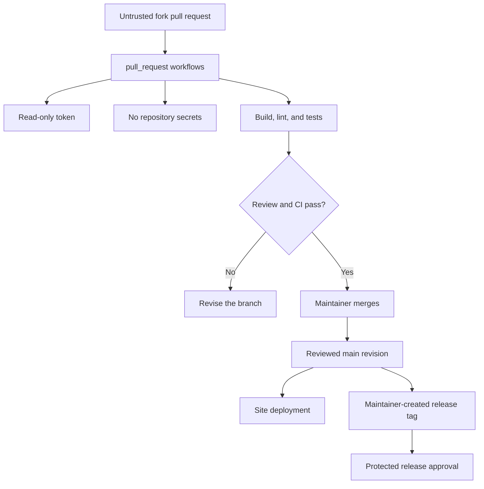

# Workflow diagrams

These diagrams provide mental models for the tools used in the course. The
arrows describe relationships, not commands that students must memorize.

## From repository to running notebook

VS Code sends a code cell through its Jupyter extension to the kernel. The
kernel—not VS Code or the notebook file itself—runs Python and imports the
editable course package.

## Where should code live?

Moving code into the package is a design decision made when reuse or testing
becomes valuable, not a requirement for every small notebook example.

## Diagnosing an import problem

This sequence checks location and interpreter before installing anything.

## Filesystem orientation

## From a student fork to the shared package

The fork supplies a writable remote without granting write access to the course
repository. A pull request does not bypass ownership: it presents an exact
revision for discussion, automated checks, and maintainer integration.

## Trust boundaries in course automation

Testing contributor code and publishing trusted artifacts are different
privilege levels. Secrets and write credentials never need to cross backward
into the untrusted pull-request job.
